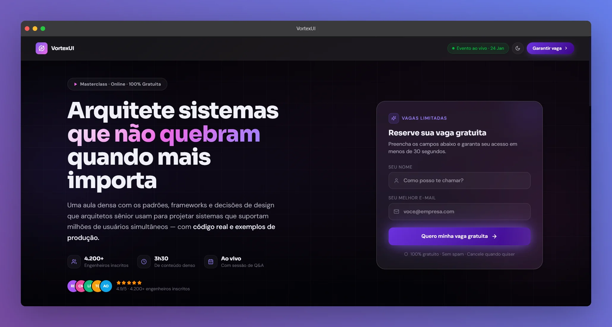

<p align="center">
  <a href="https://nextjs.org/">
    
  </a>
  <a href="https://www.typescriptlang.org/">
    
  </a>
  <a href="https://tailwindcss.com/">
    
  </a>
  <a href="https://www.framer.com/motion/">
    
  </a>
  <a href="https://zod.dev/">
    
  </a>
  <a href="https://analytics.google.com/">
    
  </a>
  <a href="https://lucide.dev/">
    
  </a>
  <a href="https://vercel.com/">
    
  </a>
</p>

# ☄️ VortexUI — Squeeze Page Template Premium



> Squeeze Page de alta conversão e estética premium desenvolvida para fins de portfólio. Stack moderna, performance máxima e UX impecável adaptável para Light/Dark mode.

_Nota: Todas as informações e marcas exibidas neste projeto são inteiramente fictícias e servem apenas como demonstração técnica de competência em engenharia de software frontend._

---

## 🛠️ Stack

| Camada        | Tecnologia                                              |
| ------------- | ------------------------------------------------------- |
| Framework     | Next.js 15 (App Router)                                 |
| Estilização   | Tailwind CSS v4 (Sintaxe CSS-first através do `@theme`) |
| Animações     | Framer Motion v11                                       |
| Formulário    | React Hook Form + Zod                                   |
| Monitoramento | Google Analytics 4 (Via `@next/third-parties`)          |
| Ícones        | Lucide React                                            |
| Deploy        | Vercel (Serverless + Edge Runtime)                      |

---

## 🚀 Início Rápido

### 1. Clone e instale

```bash
git clone https://github.com/strattegia-mp3/vortexui.git
cd vortexui
npm install
```

### 2. Configure as variáveis de ambiente

```bash
cp .env.example .env.local
# Abra o arquivo .env.local e configure suas chaves do Sentry e Google Analytics
```

### 3. Rode o servidor de desenvolvimento

```bash
npm run dev
# Acesse http://localhost:3000
```

---

## 📂 Arquitetura do Projeto

O projeto foi totalmente refatorado visando a Separação de Preocupações (SoC), garantindo que as regras de estilização, os dados do site e a tipagem estejam desacoplados das visões:

```plaintext
src/
├── app/
│   ├── api/leads/route.ts        # Route Handler (POST /api/leads)
│   ├── globals.css               # Tailwind v4 @theme, variáveis dinâmicas Light/Dark
│   ├── layout.tsx                # Layout principal com injeção de SEO, Fontes e GA4
│   ├── page.tsx                  # Estrutura unificada da Landing Page (Scroll Progress)
│   ├── robots.ts                 # Geração dinâmica nativa do arquivo robots.txt
│   └── sitemap.ts                # Geração dinâmica nativa do arquivo sitemap.xml
├── components/
│   ├── index.ts                  # Ponto único de exportação dos componentes (Barrel)
│   ├── Navbar.tsx                # Menu fixo com suporte a blur de vidro e ThemeToggle
│   ├── Hero.tsx                  # Seção principal com textos dinâmicos e prova social
│   ├── Trust.tsx                 # Marquee infinito de empresas com cores geradas dinamicamente
│   ├── Benefits.tsx              # Grid modular de cards com gradientes CSS e microinterações
│   ├── Testimonials.tsx          # Seção de depoimentos com aspas decorativas dinâmicas
│   ├── CTA.tsx                   # Chamada para ação final com animação de pulsão (Glow)
│   ├── Footer.tsx                # Rodapé estruturado com links e marcas dinâmicas
│   ├── LeadForm.tsx              # Componente de captura isolado (Zod + RHF) com estados de submissão
│   ├── ThemeToggle.tsx           # Alternador de tema Light/Dark fluido com Framer Motion
│   └── ThemeProvider.tsx         # Provedor do next-themes para evitar FOUC (Flicker de CSS)
├── lib/
│   └── constants.ts              # Arquivo centralizador de cópias, textos, links e dados
└── types/
    └── index.ts                  # Definições estritas de interfaces TypeScript
```

---

## 🔃 Fluxo do Formulário & Eventos

Usuário preenche → RHF valida (onBlur) → Submit do Form  
↓  
POST /api/leads  
↓  
Zod valida no Servidor → persistLead() [mock]  
↓ ↓  
422 Unprocessable Entity Sucesso da API  
Exibe feedback de erro Dispara: sendGAEvent('generate_lead')  
Auto-reset após 5 segundos Substitui formulário por SuccessState inline


## 📄 Estados da UI do Formulário

| Estado     | Descrição                                                                           |
| ---------- | ----------------------------------------------------------------------------------- |
| idle       | Estado padrão, inputs limpos ou editáveis e botão ativo.                            |
| submitting | Inputs congelados, botão com indicador Loader rodando, Shimmer ativo.               |
| success    | Form desmonta; exibe Checkmark com SVG animado e mensagem de sucesso personalizada. |
| error      | Alerta vermelho com a mensagem retornada pela API ou falha de rede.                 |

---

## 📊 Configurando o Google Analytics (GA4)

A Landing Page faz uso da biblioteca nativa `@next/third-parties`. O script é baixado de forma assíncrona apenas quando o navegador do cliente está ocioso, garantindo que o rastreamento não reduza a pontuação de performance.

Para ativar, basta preencher a seguinte chave no arquivo `.env.local`:

```bash
NEXT_PUBLIC_GA_MEASUREMENT_ID=G-XXXXXXXXXX
```

---

## ⚡ Performance e Otimização de SEO (PageSpeed 95+)

### Estratégias de Infraestrutura e Código Implementadas

- Zero Layout Shift nas Fontes: As fontes Sora e DM Sans são baixadas pelo compilador do Next.js no momento do build e hospedadas localmente. Tags `<link rel="preconnect">` foram removidas do HTML para evitar handshakes HTTP redundantes.
- Tema Claro/Escuro Avançado: Em vez de depender de classes utilitárias pesadas repetidas em cada elemento, os fundos, textos e bordas consomem variáveis nativas de CSS (`--surf-0`, `--text-pri`) injetadas no escopo do `@theme` do Tailwind v4.
- Structured Data (JSON-LD): O arquivo `layout.tsx` injeta o formato estruturado de Event mapeado rigorosamente com todos os parâmetros exigidos pelo validador oficial de Rich Snippets do Google (incluindo `startDate`, `VirtualLocation` e `offers`).

## ⚖️ Licença e Uso

**Proprietária (Uso restrito para estudos)**

Este código-fonte está publicado publicamente apenas para fins de avaliação de portfólio técnico e estudo de arquitetura. É expressamente proibida a cópia total ou parcial, modificação, revenda ou redistribuição comercial deste projeto sem consentimento prévio por escrito do autor. Veja o arquivo [LICENSE](./LICENSE) para mais detalhes.

<div align="right">
  <p><code>~ $ "Desenvolvido com 💜 e TypeScript por Victor Rocha."</code></p>
</div>
